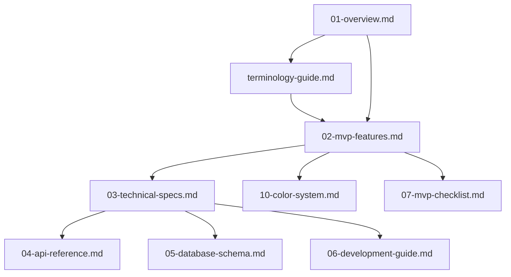

# Scrypture MVP Documentation Index

*"Essential documentation for Scrypture MVP development - focused, practical, and implementable"*

## 🚀 **Quick Start for Developers**

### **New to Scrypture? Start Here:**
1. **[quick-start-guide.md](quick-start-guide.md)** - Get up and running in 30 minutes (30 min read)
2. **[01-overview.md](01-overview.md)** - Project vision and core concepts (5 min read)
3. **[terminology-guide.md](terminology-guide.md)** - Terminology rules and implementation (3 min read)
4. **[02-mvp-features.md](02-mvp-features.md)** - Essential MVP features and implementation (15 min read)
5. **[03-technical-specs.md](03-technical-specs.md)** - System architecture and technical details (10 min read)
6. **[04-api-reference.md](04-api-reference.md)** - API endpoints and integration (10 min read)
7. **[05-database-schema.md](05-database-schema.md)** - Database design and migrations (5 min read)
8. **[06-development-guide.md](06-development-guide.md)** - Setup, implementation, and deployment (15 min read)
9. **[07-mvp-checklist.md](07-mvp-checklist.md)** - Implementation tracking and status (5 min read)
10. **[12-achievement-system.md](12-achievement-system.md)** - Complete Achievement system documentation (20 min read)
11. **[bobr-companion-guide.md](bobr-companion-guide.md)** - Complete Bóbr Companion system documentation (15 min read)

### **For Specific Roles:**
- **👤 New Users**: [quick-start-guide.md](quick-start-guide.md) → [01-overview.md](01-overview.md) → [02-mvp-features.md](02-mvp-features.md)
- **👨‍💻 Developers**: [quick-start-guide.md](quick-start-guide.md) → [06-development-guide.md](06-development-guide.md) → [03-technical-specs.md](03-technical-specs.md) → [04-api-reference.md](04-api-reference.md)
- **🎨 Designers**: [quick-start-guide.md](quick-start-guide.md) → [02-mvp-features.md](02-mvp-features.md) → [10-color-system.md](10-color-system.md)
- **📊 Product Managers**: [quick-start-guide.md](quick-start-guide.md) → [01-overview.md](01-overview.md) → [07-mvp-checklist.md](07-mvp-checklist.md)

## 📚 **Documentation Overview**

This index serves as the master navigation guide for the Scrypture MVP documentation suite. It organizes all documentation into logical groups, maps dependencies, and provides quick access to specific information.

### **MVP Documentation Philosophy**
- **Essential Features Only**: 30 core features that deliver the core value proposition
- **Implementation First**: Focus on practical implementation over comprehensive specifications
- **User-Centric**: Every feature serves a clear user need
- **Progressive Enhancement**: Start simple, add complexity later
- **Quality Over Quantity**: 30 well-implemented features > 100+ incomplete features
- **Terminology Consistency**: All code uses plain English, UI can display Latin mode (toggleable)

## 🎯 **Quick Navigation**

### **By Development Phase**
- **🚀 Planning**: [01-overview.md](01-overview.md) → [02-mvp-features.md](02-mvp-features.md)
- **⚙️ Development**: [06-development-guide.md](06-development-guide.md) → [03-technical-specs.md](03-technical-specs.md) → [04-api-reference.md](04-api-reference.md)
- **🧪 Testing**: [06-development-guide.md](06-development-guide.md) → [07-mvp-checklist.md](07-mvp-checklist.md)
- **🚀 Deployment**: [06-development-guide.md](06-development-guide.md) → [03-technical-specs.md](03-technical-specs.md)

### **By User Role**
- **👤 New Users**: [01-overview.md](01-overview.md) → [02-mvp-features.md](02-mvp-features.md) → [07-mvp-checklist.md](07-mvp-checklist.md)
- **👨‍💻 Developers**: [06-development-guide.md](06-development-guide.md) → [03-technical-specs.md](03-technical-specs.md) → [04-api-reference.md](04-api-reference.md)
- **🎨 Designers**: [02-mvp-features.md](02-mvp-features.md) → [10-color-system.md](10-color-system.md)
- **📊 Product Managers**: [01-overview.md](01-overview.md) → [07-mvp-checklist.md](07-mvp-checklist.md)

## 📋 **Documentation Categories**

### **1. Core Documentation** 📖
*Essential documentation for MVP development*

| Document | Purpose | Target Audience | Dependencies | Status |
|----------|---------|-----------------|--------------|--------|
| **[quick-start-guide.md](quick-start-guide.md)** | Get developers up and running quickly | New developers, contributors | None | ✅ Complete |
| **[01-overview.md](01-overview.md)** | Project vision, core concepts, target audience | All users, stakeholders | None | ✅ Complete |
| **[terminology-guide.md](terminology-guide.md)** | Terminology rules and implementation guidelines | All users, developers | 01-overview.md | ✅ Complete |
| **[02-mvp-features.md](02-mvp-features.md)** | MVP feature specifications and user flows | Developers, designers, users | 01-overview.md, terminology-guide.md | ✅ Complete |
| **[03-technical-specs.md](03-technical-specs.md)** | System architecture, performance, security | Developers, architects | 01-overview.md, 02-mvp-features.md | ✅ Complete |
| **[04-api-reference.md](04-api-reference.md)** | API endpoints, authentication, responses | Frontend/backend developers | 03-technical-specs.md | ✅ Complete |
| **[05-database-schema.md](05-database-schema.md)** | Database design, relationships, indexes | Backend developers, DBAs | 03-technical-specs.md | ✅ Complete |
| **[06-development-guide.md](06-development-guide.md)** | Setup, implementation, deployment | Developers, DevOps | 03-technical-specs.md | ✅ Complete |
| **[07-mvp-checklist.md](07-mvp-checklist.md)** | Implementation tracking and status | Developers, QA, product managers | 02-mvp-features.md | ✅ Complete |
| **[test-suite-improvements.md](test-suite-improvements.md)** | Test suite enhancements and current status | Developers, QA engineers | 06-development-guide.md | ✅ Complete |
| **[development-workflow-guide.md](development-workflow-guide.md)** | Edit 1 thing, test, document workflow | All developers | 06-development-guide.md | ✅ Complete |

**Key Concepts**: MVP features, technical architecture, implementation guidance, deployment procedures

### **2. Design Documentation** 🎨
*Visual design and user experience specifications*

| Document | Purpose | Target Audience | Dependencies |
|----------|---------|-----------------|--------------|
| **[10-color-system.md](10-color-system.md)** | Color palette, accessibility, theming | Designers, frontend developers | 02-mvp-features.md |
| **[11-ui-enhancements.md](11-ui-enhancements.md)** | Recent UI enhancements and UX improvements | Designers, frontend developers, users | 02-mvp-features.md, 10-color-system.md |

**Key Concepts**: User experience, accessibility compliance, design system, responsive design, UI enhancements

### **3. Audio & Sound Documentation** 🎵
*Sound engine and audio system specifications*

| Document | Purpose | Target Audience | Dependencies |
|----------|---------|-----------------|--------------|
| **[13-synthesizer-sound-engine.md](13-synthesizer-sound-engine.md)** | Complete synthesizer sound engine documentation | Audio developers, frontend developers, designers | 02-mvp-features.md, 03-technical-specs.md |

**Key Concepts**: Web Audio API, real-time synthesis, musical composition, gamified audio feedback, Scrypture integration

## 🔗 **Dependency Mapping**

### **Core Dependencies (MVP)**

## 📖 **Reading Paths**

### **For New Team Members**
1. **[quick-start-guide.md](quick-start-guide.md)** - Get up and running (30 min)
2. **[01-overview.md](01-overview.md)** - Understand the project vision (5 min)
3. **[02-mvp-features.md](02-mvp-features.md)** - Learn about core features (15 min)
4. **[07-mvp-checklist.md](07-mvp-checklist.md)** - Know what to implement (5 min)

### **For Developers**
1. **[quick-start-guide.md](quick-start-guide.md)** - Quick setup and first contribution (30 min)
2. **[06-development-guide.md](06-development-guide.md)** - Detailed setup and implementation (15 min)
3. **[03-technical-specs.md](03-technical-specs.md)** - System architecture (10 min)
4. **[04-api-reference.md](04-api-reference.md)** - API endpoints (10 min)
5. **[05-database-schema.md](05-database-schema.md)** - Data models (5 min)
6. **[07-mvp-checklist.md](07-mvp-checklist.md)** - Implementation tasks (5 min)

### **For Designers**
1. **[02-mvp-features.md](02-mvp-features.md)** - User experience flows (15 min)
2. **[10-color-system.md](10-color-system.md)** - Color palette (10 min)

### **For Product Managers**
1. **[01-overview.md](01-overview.md)** - Project vision (5 min)
2. **[07-mvp-checklist.md](07-mvp-checklist.md)** - Implementation status (5 min)

## 🔍 **Search Index**

### **By Concept**
- **Bóbr Companion**: [01-overview.md](01-overview.md), [02-mvp-features.md](02-mvp-features.md), [bobr-companion-guide.md](bobr-companion-guide.md)
- **Tasks**: [02-mvp-features.md](02-mvp-features.md), [terminology-guide.md](terminology-guide.md)
- **Habits**: [02-mvp-features.md](02-mvp-features.md)
- **Terminology**: [terminology-guide.md](terminology-guide.md), [01-overview.md](01-overview.md)
- **Themes**: [10-color-system.md](10-color-system.md)
- **Database**: [05-database-schema.md](05-database-schema.md)
- **API**: [04-api-reference.md](04-api-reference.md), [03-technical-specs.md](03-technical-specs.md)
- **Audio & Sound**: [13-synthesizer-sound-engine.md](13-synthesizer-sound-engine.md)

### **By Technology**
- **Frontend**: [02-mvp-features.md](02-mvp-features.md), [10-color-system.md](10-color-system.md)
- **Backend**: [03-technical-specs.md](03-technical-specs.md), [05-database-schema.md](05-database-schema.md), [04-api-reference.md](04-api-reference.md)
- **Development**: [06-development-guide.md](06-development-guide.md), [03-technical-specs.md](03-technical-specs.md)
- **Design**: [10-color-system.md](10-color-system.md)
- **Audio**: [13-synthesizer-sound-engine.md](13-synthesizer-sound-engine.md)

## 📝 **Documentation Standards**

### **File Naming Convention**
- **00-**: Index and navigation documents
- **01-06**: Core MVP documentation (overview, features, technical, API, database, development)
- **07**: Implementation tracking
- **10**: Design documentation

### **Content Structure**
Each document should include:
1. **Header**: Title, version, status badges
2. **Overview**: Purpose and target audience
3. **Main Content**: Detailed information
4. **Cross-References**: Links to related documents
5. **Implementation**: Code examples and technical details (where applicable)

### **MVP Focus Guidelines**
- **Essential Features**: Document only MVP features (30 core features)
- **Implementation First**: Prioritize practical implementation guidance
- **Progressive Enhancement**: Start simple, add complexity later
- **Developer Experience**: Focus on setup, development, and deployment

### **Update Process**
1. **Review**: Regular review of documentation accuracy
2. **Update**: Update documents when features change
3. **Cross-Reference**: Ensure all links remain valid
4. **Version**: Update version numbers and dates
5. **Index**: Update this index when documents change

## 🚀 **Quick Reference**

### **Most Important Documents**
- **[quick-start-guide.md](quick-start-guide.md)** - Start here for new developers
- **[01-overview.md](01-overview.md)** - Project vision and understanding
- **[terminology-guide.md](terminology-guide.md)** - Terminology rules and implementation
- **[02-mvp-features.md](02-mvp-features.md)** - Core feature specifications
- **[06-development-guide.md](06-development-guide.md)** - Implementation guidance
- **[03-technical-specs.md](03-technical-specs.md)** - System architecture
- **[04-api-reference.md](04-api-reference.md)** - API reference

### **Recently Updated**
- **[quick-start-guide.md](quick-start-guide.md)** - New comprehensive developer onboarding guide
- **[00-documentation-index.md](00-documentation-index.md)** - MVP-focused reorganization
- **[terminology-guide.md](terminology-guide.md)** - New comprehensive terminology guide
- **[02-mvp-features.md](02-mvp-features.md)** - Simplified feature specifications with implementation examples
- **[03-technical-specs.md](03-technical-specs.md)** - Simplified technical architecture
- **[04-api-reference.md](04-api-reference.md)** - Simplified API documentation
- **[05-database-schema.md](05-database-schema.md)** - Simplified database design
- **[06-development-guide.md](06-development-guide.md)** - New implementation guide with practical examples

## 📞 **Documentation Support**

### **Getting Help**
- **Missing Information**: Check related documents in the dependency map
- **Conflicting Information**: Refer to the most recently updated document
- **Technical Questions**: Start with [03-technical-specs.md](03-technical-specs.md)
- **Implementation Questions**: Use [06-development-guide.md](06-development-guide.md)
- **Feature Questions**: Check [02-mvp-features.md](02-mvp-features.md)

### **Contributing**
- **Adding Content**: Follow the content structure standards
- **Updating**: Update version numbers and cross-references
- **Reviewing**: Ensure accuracy and completeness
- **Indexing**: Update this index when documents change

---

## 📚 **Documentation Statistics**

| Category | Documents | Pages | Last Updated | Status |
|----------|-----------|-------|--------------|--------|
| **Core Documentation** | 9 | ~1,500 | 2024-01-15 | ✅ Complete |
| **Design Documentation** | 1 | ~200 | 2024-01-15 | ✅ Complete |
| **Audio & Sound Documentation** | 1 | ~400 | 2024-01-15 | ✅ Complete |
| **Total** | **11** | **~2,100** | **2024-01-15** | **✅ MVP Ready** |

---

*"In the pages of this index, every document finds its place, every concept its home, and every reader their path to understanding."* 📚✨ 